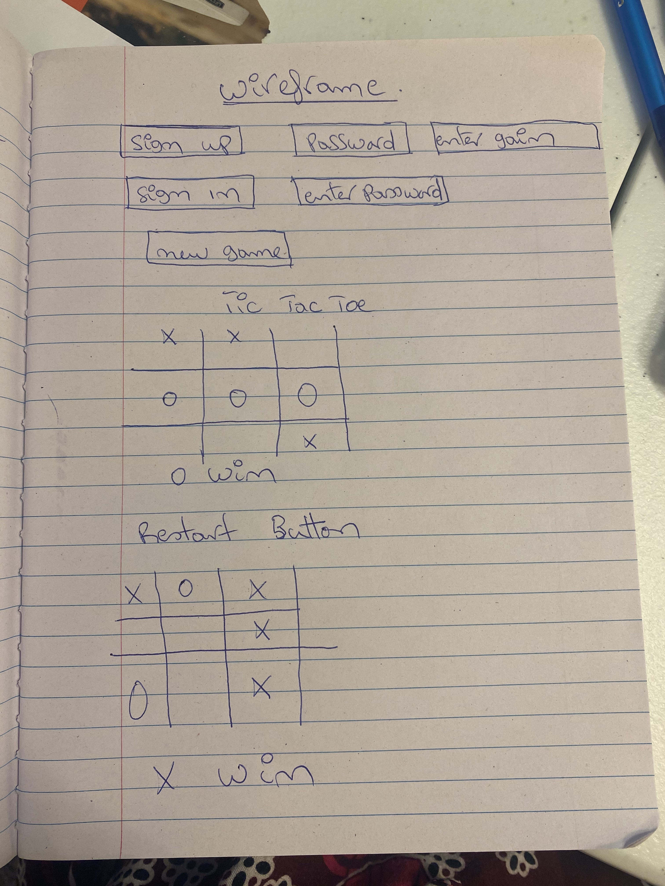

It is a game play by two people call X AND O
it started by sign up 
sign in
and started the game 
the first player is X
and second player is O
when you click the board it should present X
then when you click again O will pop up 
if the next click show 3 X after 3 click then it is the win for X
same as O if it pop up 3 times after the click then O win 
if none of them does'nt show align after 3 click then it is a tie and the player have to started over. 
